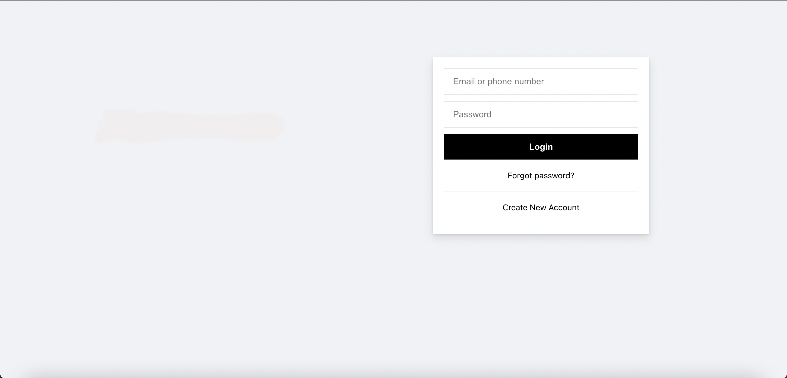
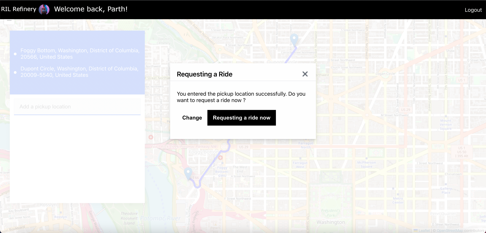
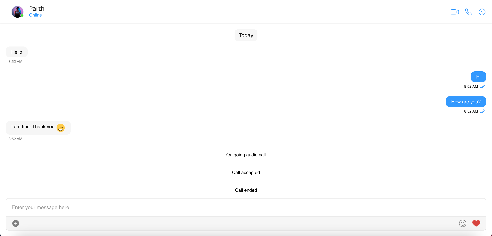

## Run

To run the demo follow these steps:

1. [Head to CometChat Pro and create an account](https://app.cometchat.com/signup)
2. From the [dashboard](https://app.cometchat.com/apps), add a new app called **"uber-clone"**
3. Select this newly added app from the list.
4. From the Quick Start copy the **APP_ID, APP_REGION and AUTH_KEY**. These will be used later.
5. Also copy the **REST_API_KEY** from the API & Auth Key tab.
6. Navigate to the Users tab, and delete all the default users and groups leaving it clean **(very important)**.
7. Download the repository [here](https://github.com/codecourses-site/uber-clone/archive/main.zip) or by running `git clone https://github.com/codecourses-site/uber-clone.git` and open it in a code editor.
8. [Head to Firebase and create a new project](https://console.firebase.google.com)
9. Create a file called **.env** in the root folder of your project.
10. Import and inject your secret keys in the **.env** file containing your CometChat and Firebase in this manner.

```js
REACT_APP_FIREBASE_API_KEY = xxx - xxx - xxx - xxx - xxx - xxx - xxx - xxx
REACT_APP_FIREBASE_AUTH_DOMAIN = xxx - xxx - xxx - xxx - xxx - xxx - xxx - xxx
REACT_APP_FIREBASE_DATABASE_URL = xxx - xxx - xxx - xxx - xxx - xxx - xxx - xxx
REACT_APP_FIREBASE_STORAGE_BUCKET =
  xxx - xxx - xxx - xxx - xxx - xxx - xxx - xxx

REACT_APP_COMETCHAT_APP_ID = xxx - xxx - xxx - xxx - xxx - xxx - xxx - xxx
REACT_APP_COMETCHAT_REGION = xxx - xxx - xxx - xxx - xxx - xxx - xxx - xxx
REACT_APP_COMETCHAT_AUTH_KEY = xxx - xxx - xxx - xxx - xxx - xxx - xxx - xxx
REACT_APP_COMETCHAT_API_KEY = xxx - xxx - xxx - xxx - xxx - xxx - xxx - xxx

REACT_APP_MAP_BOX_API_KEY = xxx - xxx - xxx - xxx - xxx - xxx - xxx - xxx
```

11. Make sure to exclude **.env** in your gitIgnore file from being exposed online.
12. Run the following command to install the app.

```sh
    npm install
    npm run start
```
